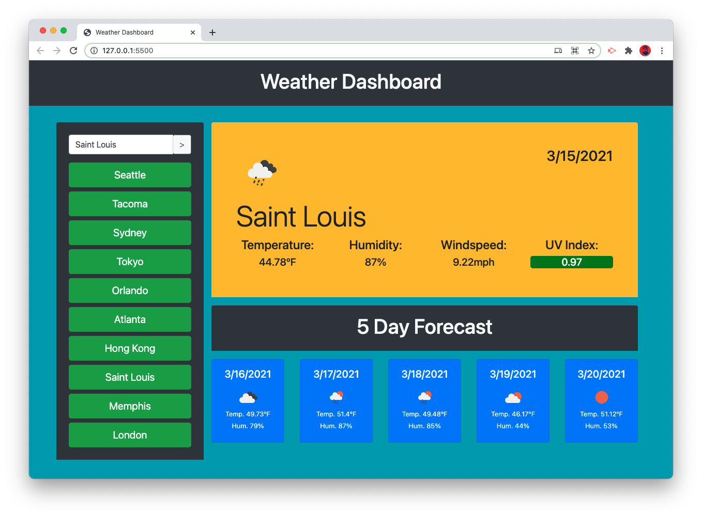

# Weather Dashboard

[link to deployed application](https://matthewxgoad.github.io/weather-dashboard/)

## Description

This application allows the user to input a known city name and retreive the following weather data:

* current date
* current temperature
* current humidity
* current wind speed
* current UV index
* five day temperature (high)
* five day humidity

## Credits

This application was coded by _Matthew Goad_ with the help of classmates, friends, and instructors in the Trilogy Education / Washington University coding boot camp program. 

## License

Use it. I'm cool.  